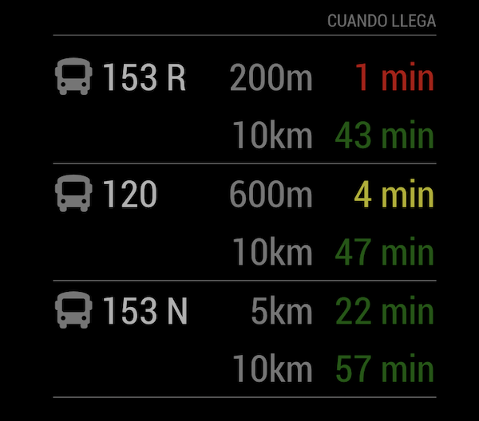

# MMM-CuandoLlega
A [MagicMirror²](https://magicmirror.builders) helper module to get estimated arrival times from Rosario, Santa Fe, Argentina buses.

The module uses rosario.gob.ar's API published at https://editor.swagger.io/?url=https://ws.rosario.gob.ar/ubicaciones/v2/api-docs/

You can see an example here: https://ws.rosario.gob.ar/ubicaciones/public/cuandollega?parada=1847&linea=K

[](https://raw.githubusercontent.com/bibaldo/MMM-CuandoLlega/master/LICENSE)

 

## Installation

In your terminal, go to your MagicMirror's Module folder:
````
cd ~/MagicMirror/modules
````

Clone this repository:
````
git clone https://github.com/bibaldo/MMM-CuandoLlega.git
````

Add the module to the modules array in the `config/config.js` file:
````javascript
  {
    module: "MMM-CuandoLlega"
  },
````

## Configuration options

The following properties can be configured:


| Option                       | Description
| ---------------------------- | -----------
| `header`                     | The header text <br><br> **Default value:** `'Cuando Llega'`
| `buses`                      | The lines (Buses) that we want to get live information <br><br> **Default value:** `[ { line: '120', stop: 8317 }, { line: '153 N', stop: 4146 }, { line: '153 R', stop: 4146 } ]`
| `mmLocation`                 | Where your MagicMirror is located <br> **Default value:** `[ -32.9536595, -60.6431701 ]` // [ latitude, longitude ]
| `infoClass`                  | The font size of data <br><br> **Possible values:** `'small'`, `'medium'`, `'big'` <br> **Default value:** `'big'`
| `updateInterval`             | How often does the content needs to be fetched (milliseconds) <br><br> **Possible values:** `1000` - `86400000` <br> **Default value:** `30000` (30 seconds)

## Config Example

````javascript
  {
    module: "MMM-CuandoLlega",
    position: "top_right",
    config: {
      header: 'Cuando Llega',
      buses: [
        {
          line: '120', // 120 Único
          stop: 8317
        },
        {
          line: '153 N', // 153 Negra
          stop: 4146
        },
        {
          line: '153 R', // 153 Roja
          stop: 4146
        }
      ],
      mmLocation: [ -32.9536595, -60.6431701 ],
      updateInterval: 60000,
      fadeSpeed: 4000,
      infoClass: 'big'
    }
  },
````

## Updating

To update the module to the latest version, use your terminal to go to your MMM-CuandoLlega module folder and type the following command:

````
git pull
```` 


## Extra notes

I use this module in combination with `MMM-ModuleScheduler`, so I can have this module pulling the info of the buses during a fixed time per day. In my case it is only from 06:20am to 07:05am, every weekday. You should read the `MMM-ModuleScheduler` documentation in order to accomplish this.


Feel free to open any Issue :smiley: